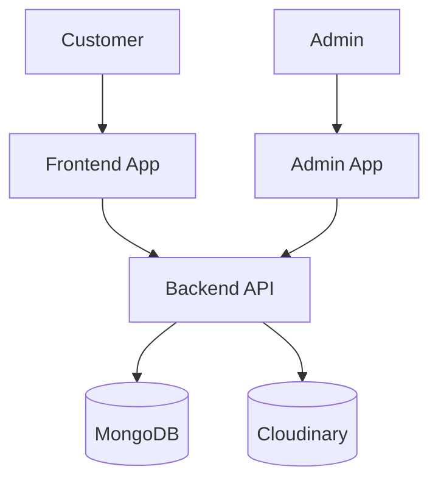
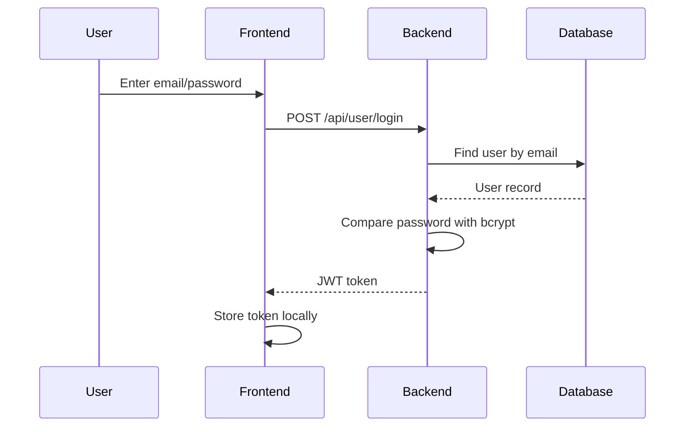
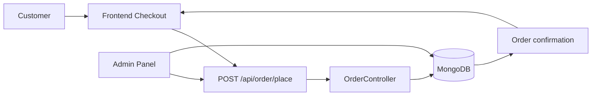
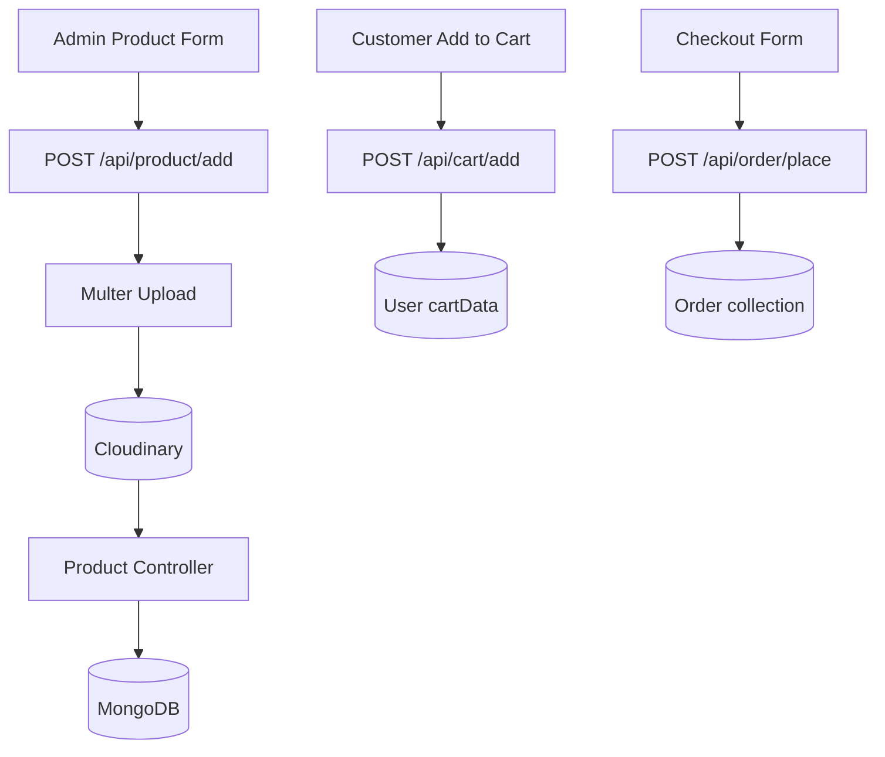

# Architecture

## High-Level Architecture



The project is organized as three applications sharing a common backend API layer. The frontend is for browsing and purchasing, the admin app is for product and order management, and the backend is responsible for authentication, validation, data access, and cloud storage.

## Frontend Architecture

The customer frontend is built using React and Vite. It contains routes for:

- Home
- Collection
- Product detail
- Cart
- Login / registration
- Orders
- Checkout

State is managed primarily through a React context provider in `Frontend/src/context/ShopContext.jsx`. This context stores cart data, product data, tokens, and search state. The frontend calls backend endpoints via Axios and updates state after responses.

## Admin Architecture

The admin app is a separate React application created for internal management tasks. It includes:

- login screen
- product add form
- product list manager
- order management panel

The admin application uses environment configuration to point to the backend API and uses the same JWT-style token flow for protected admin operations.

## Backend Architecture

The backend follows a standard Express request lifecycle:

```text
Request
 ↓
Route
 ↓
Middleware
 ↓
Controller
 ↓
Database / External Service
 ↓
Response
```

This project uses route files for authentication, products, cart, and orders. Controllers manage business logic. Middleware handles token checking and multipart uploads. Database models define the persisted entities.

## Authentication Flow



The current implementation is based on JWT issuance and verification. This is functional for a basic ecommerce app but should be strengthened with role-aware authorization and better validation.

## Order Flow



Orders are created from cart data and delivery information. The backend stores order records and clears cart data after an order is placed. Admins can later list orders and update their status.

## Data Flow



This represents the major implemented flows in the current repository. It is an accurate abstraction of the existing code rather than a proposed ideal architecture.

## Architecture Observations

- The system is intentionally split into multiple apps
- Frontend and admin are not deeply coupled
- API layer is a shared dependency boundary
- Database and Cloudinary are external service dependencies
- The design is understandable and appropriate to the project size
- The architecture would require additional hardening for production deployment
