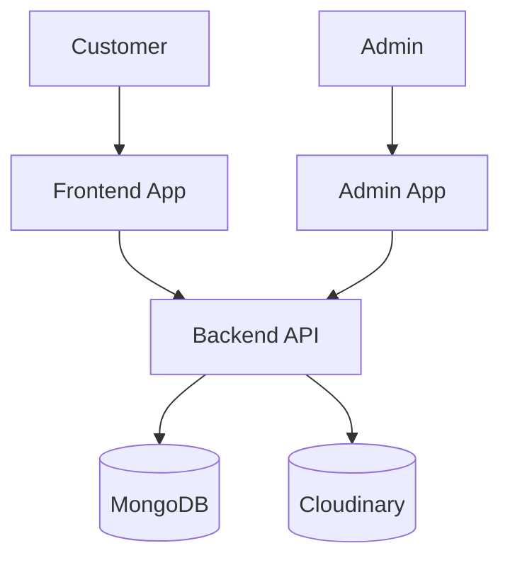
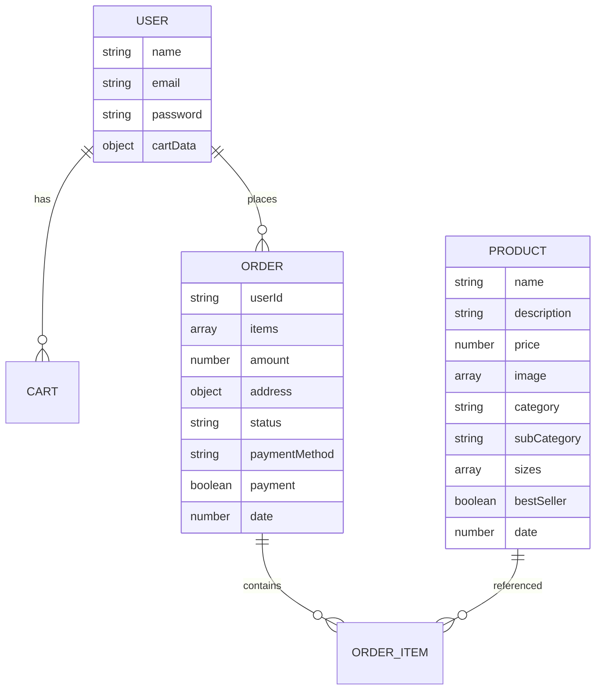

# NexCart

NexCart is a full-stack e-commerce application built as a multi-application project with a customer-facing storefront, an admin dashboard, and a backend API layer. The project demonstrates a practical client-server architecture in which customers can browse products, manage cart items, place orders, and review their order history, while administrators can add products, remove products, and update order status.

The repository contains three main application areas:

- `frontend/` for the customer storefront
- `admin/` for administrative operations
- `backend/` for API, authentication, database access, and file upload processing

The application is not presented as a production-scale platform; instead, it reflects a working e-commerce implementation with real data persistence, environment-based configuration, and basic product and order flows. It is a useful demonstration of REST API patterns, frontend state management, MongoDB integration, Cloudinary-based media uploads, and JWT authentication.

## 1. Overview

NexCart provides a basic but functional ecommerce experience. Customers can browse a product catalog, filter products, add items to cart, choose a size, and proceed to checkout. The checkout flow collects delivery information and creates an order record in MongoDB. Users can log in or register, and the cart is associated with the authenticated user.

On the administrative side, the app includes a separate admin panel where an admin can log in, add products, list existing products, remove items, and update the status of placed orders. Product data and media are stored through the backend and are persisted to MongoDB, while product images are uploaded to Cloudinary.

This repository demonstrates a complete architecture pattern for a beginner-to-intermediate full-stack web app, with separate frontend and admin interfaces connected to a shared backend API. The code is intentionally structured to show the relationship between frontend components, backend controllers, middleware, and database models.

## 2. Project Goals

This project was built to demonstrate the following engineering concepts:

- Full-stack web application structure
- Separation of customer and admin experiences
- REST API development using Express
- Database integration with MongoDB and Mongoose
- JWT-based authentication
- Product and cart workflows
- Order lifecycle management
- File upload handling with Cloudinary
- Environment-based config for frontend and backend services

The project is a practical portfolio-style example, not a production-ready commerce platform.

## 3. Features

### Customer Application

- User registration and login
- Product listing and browsing
- Product detail view
- Product search/filtering on the frontend
- Cart add/update operations
- Cart total calculation
- Checkout form and order placement
- User order history display

### Admin Application

- Admin login panel
- Add product with image uploads
- View product list
- Remove products
- View all orders
- Update order status

### Backend

- Express API server
- User authentication and authorization middleware
- MongoDB models for users, products, and orders
- Product upload flow with Multer and Cloudinary
- Cart operations for authenticated users
- Order creation and order status update endpoints

## 4. Technology Stack

| Layer | Technology | Purpose |
|---|---|---|
| Frontend | React | Customer UI |
| Frontend | Vite | Frontend build tooling |
| Frontend | React Router | Routing |
| Frontend | Axios | API calls |
| Frontend | Tailwind CSS | Styling |
| Admin | React | Admin UI |
| Admin | Vite | Admin build tooling |
| Admin | Axios | Admin API calls |
| Admin | Tailwind CSS | Styling |
| Backend | Node.js | Server runtime |
| Backend | Express | API framework |
| Backend | MongoDB | Database |
| Backend | Mongoose | ODM |
| Backend | JWT | Authentication tokens |
| Backend | bcrypt | Password hashing |
| Backend | multer | File upload handling |
| Backend | Cloudinary | Image storage |
| Backend | CORS | Cross-origin handling |
| Backend | dotenv | Environment variables |

## 5. Architecture



The frontend and admin applications are separate React apps that both communicate with the same backend API. The backend handles database persistence, product media uploads, cart logic, and order lifecycle management.

## 6. Application Flow

- User authentication: users can register and log in using the customer app; a JWT is issued and stored locally.
- Product browsing: the storefront loads products from the backend and displays them in collections, product cards, and a product detail page.
- Cart operations: cart state is tracked in the frontend context and synced to backend cart data for authenticated users.
- Checkout/order creation: the customer submits personal details and places an order via the backend order endpoint.
- Admin operations: the admin app authenticates and uses protected routes to manage products and orders.
- Image upload: admin product creation uploads images using multipart form data; files are uploaded to Cloudinary.
- Database interaction: users, products, cart data, and orders are persisted in MongoDB via Mongoose models.

## 7. Project Structure

```text
/frontend/        Customer-facing React app
/admin/           Admin dashboard React app
/backend/        Express MongoDB API and business logic
/docs/            Technical documentation and evaluation records
```

The frontend is responsible for customer experiences, the admin app manages inventory and orders, and the backend provides the shared API and persistence layer.

## 8. API Overview

### Authentication

- `POST /api/user/register`
- `POST /api/user/login`
- `POST /api/user/admin`

### Products

- `GET /api/product/list`
- `POST /api/product/add`
- `POST /api/product/remove`
- `POST /api/product/single`

### Cart

- `POST /api/cart/get`
- `POST /api/cart/add`
- `POST /api/cart/update`

### Orders

- `POST /api/order/place`
- `POST /api/order/userorders`
- `POST /api/order/list`
- `POST /api/order/status`

### Admin

- Protected admin routes are used for product management and order administration.

No secrets, tokens, API keys, or environment values are documented here.

## 9. Database

The application uses MongoDB through Mongoose. The main data entities are:

- Users
- Products
- Orders

Important models include:

- `UserModel`
- `ProductModel`
- `OrderModel`



This ER model is based on the implemented schema and should be treated as an accurate representation of the current code, not an idealized production design.

## 10. Security

### Implemented Security

- Password hashing using `bcrypt` during registration
- JWT-based authentication for user and admin access flows
- Middleware pattern for protected routes
- `dotenv`-based environment file usage

### Identified Improvements

- Secrets should not be committed to version control
- Admin authorization should use an explicit role-based model
- CORS should be restricted to trusted origins
- Input validation should be centralized and hardened
- File upload validation should be strengthened
- Rate limiting should be added

## 11. Performance Evaluation

### Observed / Measured Results

No formal performance benchmark has been performed yet.

### Potential Bottlenecks

- Product listing is not paginated
- Product filtering is handled client-side
- Large catalogs may increase render and filtering overhead
- Image uploads are not optimized before upload
- Database queries are simple but not indexed for scale

## 12. Testing

### Existing Tests

No automated tests were found in the repository at the time of evaluation.

### Manual Testing Performed

Manual workflows were reviewed through code inspection and architecture analysis, but no formal test suite or benchmark was executed as part of the repository.

### Testing Gaps

- No unit tests
- No API tests
- No integration tests
- No authentication tests
- No product tests
- No cart/order automation

## 13. Known Limitations

- Security implementation is limited and should be hardened
- Admin authorization is not modeled as a robust role-based system
- No automated testing exists
- No stable deployment configuration is present in the repository
- Payment integrations are not fully implemented
- Product search/filtering is not backend-managed
- No pagination exists for catalog management
- No formal performance benchmark has been performed

## 14. Deployment

The intended deployment architecture is:

- Frontend → Vercel
- Admin → Vercel
- Backend → Render or Railway
- Database → MongoDB Atlas
- Image Storage → Cloudinary

Deployment status: Planned

The repository contains environment configuration examples for local development, but no verified production deployment configuration was found.

## 15. Evaluation Summary

| Area | Score |
|---|---:|
| Frontend Architecture | 6/10 |
| Backend Architecture | 6/10 |
| Database Design | 6/10 |
| Security | 3/10 |
| Authentication | 4/10 |
| Authorization | 3/10 |
| Error Handling | 4/10 |
| Performance | 5/10 |
| Scalability | 4/10 |
| Testing | 1/10 |
| Deployment Readiness | 4/10 |
| Overall | 4.7/10 |

These scores reflect the actual implementation at the time of review and should be treated as honest technical evaluation, not optimistic scoring.

## 16. Engineering Learnings

This project demonstrates the following concepts:

- REST API design
- Client-server architecture
- Authentication with JWT
- Authentication middleware patterns
- Database integration using Mongoose
- State management with React context
- File upload handling with Cloudinary
- API integration using Axios
- Environment configuration for application settings

## 17. Future Improvements

The following improvements are relevant future work, but they are not implemented in the current state of the project:

- Stronger role-based authorization
- Inventory tracking and low-stock alerts
- Server-side filtering, searching, and pagination
- Better API validation and centralized error handling
- Automated testing and CI/CD
- Production deployment hardening and environment management

## 18. Screenshots

Screenshots should be added manually when available. Recommended placeholder paths include:

- `docs/screenshots/home.png`
- `docs/screenshots/product.png`
- `docs/screenshots/cart.png`
- `docs/screenshots/login.png`
- `docs/screenshots/checkout.png`
- `docs/screenshots/orders.png`
- `docs/screenshots/admin-dashboard.png`
- `docs/screenshots/admin-products.png`
- `docs/screenshots/admin-orders.png`

These placeholders are included as future capture points and do not represent actual existing images in the repository.

---

This README documents the project as it exists in the repository today without modifying functionality or claiming future features as already implemented.


## 🌐 Live Demo

| Service | Link |
|---|---|
| 🛍️ Frontend | [Live Store](https://nex-cart-frontend-sigma.vercel.app) |
| 🛠️ Admin Dashboard | [Admin Panel](https://nex-cart-admin.vercel.app) |
| ⚙️ Backend API | [Backend](https://nex-cart-backend-phi.vercel.app) |