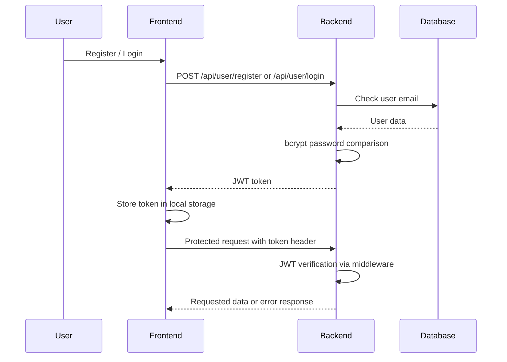

# Authentication Flow

## Current Implementation

The application uses JWT-based authentication.

## Admin Authentication

The admin flow also uses a token header, but the actual authorization check is based on a weak comparison pattern rather than an explicit role model.

## Current Observations

- User auth is implemented with JWT and bcrypt
- Admin auth is present but not robust
- Token is stored in local storage in the client applications
- Protected routes are enforced by middleware

## Important Limitation

This authentication flow should not be treated as production-grade authorization. The current implementation is functional for a tutorial/project-style app, but it is not a strong real-world authorization model.
