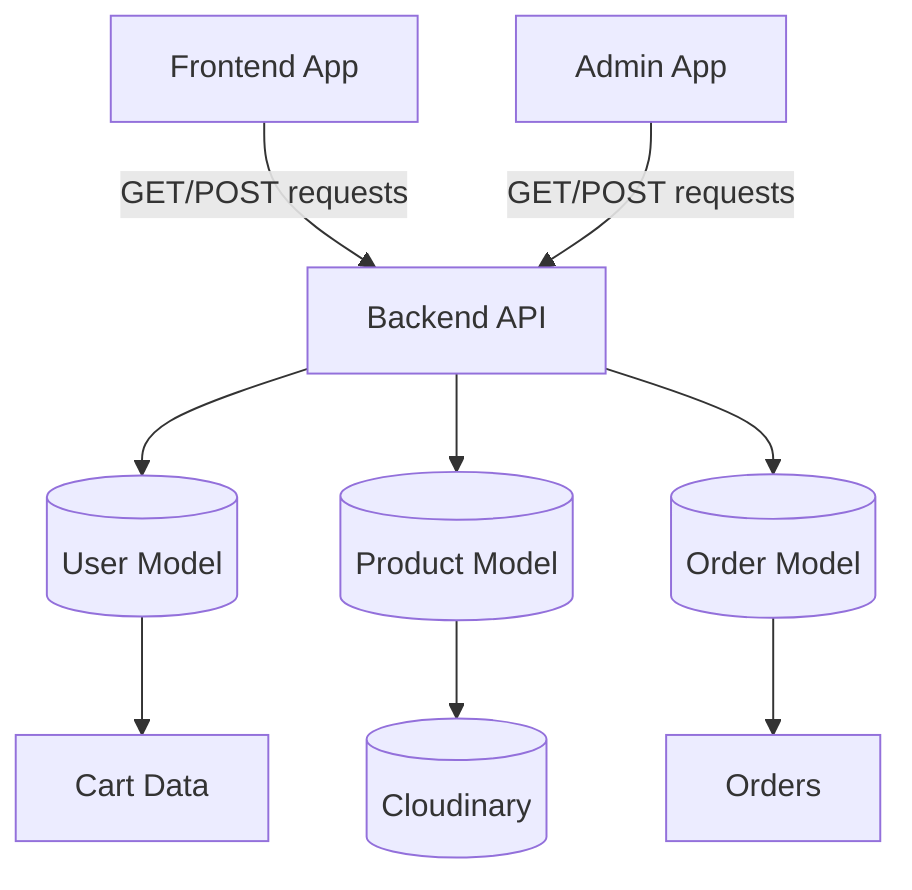

# Data Flow

## Core Data Movement

## Product Data Flow

- Admin uploads product images and metadata
- Backend stores uploaded image URLs from Cloudinary
- Product model records the product details in MongoDB
- Frontend reads the catalog from the backend

## Cart Data Flow

- Cart is updated in the frontend state
- Authenticated requests sync cart data with the user model
- User document stores `cartData` as an object

## Order Data Flow

- Delivery details and cart items are assembled in the frontend
- Order is placed through the backend order route
- Order data is submitted to the order model
- Admin can view and update order states

## Observations

This is a straightforward and clear flow for a small commerce app. It is functional, but it is not yet designed for high-volume catalog data or resilient inventory management.
