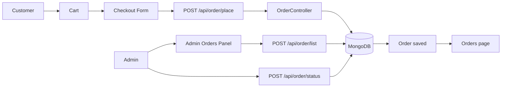

# Order Flow

## Current Order Lifecycle

## Actual Behavior

- Customer adds products to cart
- Customer provides address and payment selection on checkout
- Order is created through the backend
- Order is stored in MongoDB
- Cart data for the user is cleared after order placement
- Admin can view orders and update order status

## Important Limitation

Payment integrations such as GPay, Razorpay, and PhonePe are not fully implemented. The project currently supports a base order-placement flow based on the implemented code.
