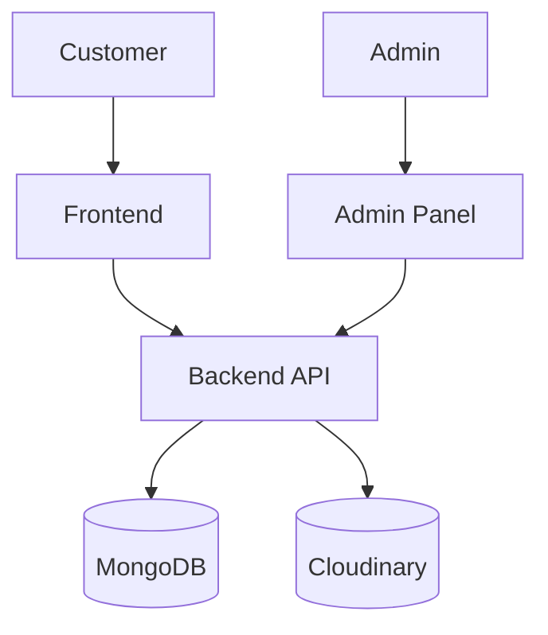

# System Architecture

## Overview

This project is structured as a small multi-application full-stack system. The customer storefront and admin panel are separate React frontends, while the backend provides a shared API layer.

## High-Level Flow

## Architectural Observations

- Frontend and admin are independent clients.
- Backend is the single integration point for access to stored data.
- MongoDB stores application data and order records.
- Cloudinary is used for uploaded product media.
- Environment variables are used to configure service endpoints and secrets.

## Layer Responsibilities

### Frontend

Handles customer-facing UI and interactions, including browsing, search, cart, checkout, and user login.

### Admin

Handles admin login, product creation, product removal, and order management.

### Backend

Handles authentication, data processing, MongoDB access, order creation, cart logic, and media uploads.

## Important Dependency Boundaries

- Frontend depends on backend API routes.
- Admin depends on backend API routes.
- Backend depends on MongoDB and Cloudinary.
- The data model is centered around users, products, and orders.

## Current Design Assessment

The architecture is coherent for a project of this scope. It demonstrates a realistic client-server pattern and is appropriate for a full-stack portfolio project. It is not yet hardened for production scaling, but the layering is clear and understandable.
